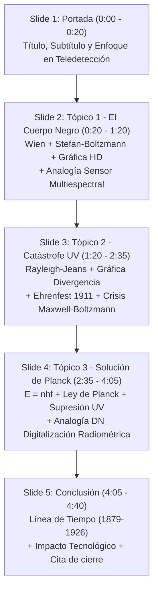

# Estructura y Guía de la Presentación PowerPoint (PPTX)

**Archivo editable generado:** `D:\00_FisicaModerna\02_TeoriaCuanticaTemprana\Evaluacion_1_Presentacion.pptx`  
**Formato:** Pantalla Ancha 16:9 (Widescreen) — 13.33 × 7.5 pulgadas  
**Estilo Visual:** Tema Oscuro Profesional (*#0D1B2A*) con tarjetas de contraste, fórmulas destacadas y gráficas HD (180 dpi) incrustadas.  
**Última actualización:** 30 jul 2026  
**Archivos complementarios:** `Guion_Video_Evaluacion_1.md` · `Evaluacion_1_App.html` · `Analisis_Evaluacion_1.md`

---

## Esquema Diapositiva por Diapositiva

---

### Diapositiva 1 — Portada
- **Título Principal:** *El Cuerpo Negro y la Revolución de Planck*
- **Subtítulo:** *De la crisis del paradigma clásico al nacimiento de la Física Cuántica*
- **Contexto:** Diplomado en Física Moderna — Evaluación 1 (5 min)
- **Enfoque Especial:** Transposición didáctica con analogías en Geomática y Teledetección.
- **Gráfica incrustada:** Espectro del cuerpo negro a 3000 K, 4500 K y 6000 K con franja del espectro visible.
- **Info box:** Formato, enfoque pedagógico, tópicos.
- **Notas de la diapo (Guión 0:00 – 0:20):** Presentación del problema, la crisis de la física a finales del s. XIX y el anuncio de la hipótesis de Planck.

---

### Diapositiva 2 — Tópico 1: La Radiación del Cuerpo Negro e Incapacidad Clásica
- **Contenido Teórico:**
  - Absorción 100% y emisión térmica pura ($\varepsilon = 1$).
  - Cavidad con orificio como modelo experimental.
  - **Stefan-Boltzmann (1879):** $R = \sigma T^4$, $\sigma = 5.67 \times 10^{-8}$ W m⁻² K⁻⁴
  - **Ley de Wien (1893):** $\lambda_{\max} \cdot T = b = 2.898 \times 10^{-3} \text{ m·K}$
- **Gráfica incrustada:**
  - `chart_blackbody.png` (HD 180 dpi — radiancia espectral a 3000 K, 4500 K y 6000 K con franja del espectro visible y λ_max señalado).
- **El Desafío:**
  - La curva experimental era precisa y medible.
  - La energía total es finita — nunca infinita.
  - Ninguna teoría clásica podía reproducirla.
- **🌍 Analogía Teledetección (tarjeta inferior):**
  - *"Un sensor multiespectral (Landsat / Sentinel-2) mide la radiancia espectral. Si la teoría clásica fuera cierta, cada banda hacia el UV sumaría energía infinita. Sin embargo, los sensores muestran que la radiancia decae en el UV, tal como mide un radiómetro de campo."*
- **Notas de la diapo (Guión 0:20 – 1:20):** Explicación del fenómeno físico, las leyes empíricas y traslape a la medición con radiómetros.

---

### Diapositiva 3 — Tópico 2: La Catástrofe del Ultravioleta: El Colapso Clásico
- **Contenido Teórico:**
  - Teorema de Equipartición clásica: $\langle E \rangle = k_B T$ por modo.
  - Densidad de modos: $g(f) = \dfrac{8\pi f^2}{c^3}$
  - **Fórmula de Rayleigh-Jeans:** $W(f, T) = \left(\dfrac{8\pi f^2}{c^3}\right) k_B T$
- **Gráfica incrustada:**
  - `chart_rj_planck.png` (HD 180 dpi — Curva Planck (relleno cyan) vs. Rayleigh-Jeans (naranja punteado) disparándose, con zona de catástrofe sombreada y flecha de divergencia).
- **La Crisis (Paul Ehrenfest, 1911):**
  - No es un error de cálculo.
  - Es consecuencia inevitable de combinar termodinámica + electromagnetismo clásicos.
  - Infinitos modos × energía fija = ∞
  - Divergencia $\int W \, df = \infty$ cuando $\lambda \to 0$.
- **Notas de la diapo (Guión 1:20 – 2:35):** Argumentación del colapso del paradigma, por qué era una crisis inevitable, y la diferencia entre "falla de cálculo" vs. "consecuencia lógica inevitable".

---

### Diapositiva 4 — Tópico 3: La Hipótesis de Planck y la Cuantización de la Energía
- **Contenido Teórico:**
  - **Postulado de Cuantización (1900):** $E_n = n \cdot hf$ ($n = 0, 1, 2, \ldots$)
  - Constante de Planck: $h = 6.626 \times 10^{-34} \text{ J·s}$
  - **Ley de Planck:** $W(f, T) = \left(\dfrac{8\pi h f^3}{c^3}\right) \frac{1}{e^{hf/k_B T} - 1}$
  - **Supresión Exponencial:** A alta frecuencia, $hf \gg k_B T$:
    - El "precio de entrada" mínimo ($hf$) supera la energía térmica disponible ($k_BT$).
    - Los modos UV quedan "congelados".
    - $W(f) \to 0$ naturalmente. ¡Sin catástrofe!
- **Gráfica incrustada:**
  - `chart_rj_planck.png` (misma gráfica comparativa, mostrando cómo Planck ajusta los datos).
- **Cita:** *"Un acto de desesperación" — Max Planck*
- **📡 Analogía Teledetección — Digitalización Radiométrica (tarjeta inferior):**
  - *"En sensores de Teledetección (Sentinel-2, LiDAR), la radiancia analógica se muestrea en Valores Digitales Discretos (DN). No existe el DN 127.5, solo 127 o 128. Planck aplicó exactamente esta discretización a la energía: si k_BT no alcanza para subir al primer peldaño (hf), el modo queda desierto."*
- **Notas de la diapo (Guión 2:35 – 4:05):** Explicación del mecanismo de supresión, la analogía radiométrica, y por qué la constante $h$ ajusta exactamente el espectro experimental.

---

### Diapositiva 5 — Conclusión: El Cambio de Paradigma en la Física
- **Línea de Tiempo Visual (7 tarjetas):**
  1. **1879 — Stefan:** $R = \sigma T^4$
  2. **1893 — Wien:** $\lambda_{\max} \cdot T = b$
  3. **1900–05 — Rayleigh-Jeans:** Catástrofe UV
  4. **1900 ★ — Planck:** $E = nhf$
  5. **1905 — Einstein:** Fotones, $E = hf$
  6. **1913 — Bohr:** $L = n\hbar$, $E_n = -13.6/n^2$ eV
  7. **1925–26 — Heisenberg / Schrödinger:** $\hat{H}\Psi = E\Psi$
- **⚡ Impacto Tecnológico (3 tarjetas):**
  - 💡 **Semiconductores** — La banda prohibida es un efecto de cuantización
  - 📡 **Sensores CMOS/CCD** — Cámaras satelitales detectan fotones individuales
  - 🔬 **Láseres / LiDAR** — Espectrometría: emisión cuántica pura
- **Cita de cierre:**
  - *"La catástrofe ultravioleta no fue una falla menor — fue la grieta por donde entró toda la física cuántica."*
- **Notas de la diapo (Guión 4:05 – 4:40):** Frase de cierre y reflexión sobre el paso de "acto de desesperación" a la física contemporánea.

---

## Paleta de Colores del PPTX

| Color | Hex | Uso |
|---|---|---|
| Fondo | `#0D1B2A` | Background de todas las slides |
| Cyan | `#00C8FF` | Títulos principales, Planck |
| Naranja | `#FF6B35` | Catástrofe UV, Rayleigh-Jeans |
| Verde menta | `#7BFF C4` | Planck, analogías teledetección |
| Amarillo | `#FFE066` | Fórmulas destacadas, conclusión |
| Púrpura | `#C084FC` | Mecánica cuántica (Schrödinger) |
| Gris | `#AAAABB` | Texto secundario, notas |
| Blanco | `#FFFFFF` | Texto principal |

## Recursos Complementarios

- **App Interactiva:** `Evaluacion_1_App.html` — Explorador con canvas interactivos, MathJax, analogías integradas
- **Guión del Video:** `Guion_Video_Evaluacion_1.md` — Texto cronometrado listo para practicar
- **Análisis de Evaluación:** `Analisis_Evaluacion_1.md` — Rúbrica, estrategia, fundamento científico
