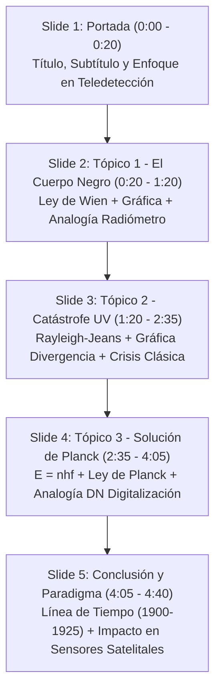

# Estructura y Guía de la Presentación PowerPoint (PPTX)

**Archivo editable generado:** `D:\00_FisicaModerna\02_TeoriaCuanticaTemprana\Evaluacion_1_Presentacion.pptx`  
**Formato:** Pantalla Ancha 16:9 (Widescreen)  
**Estilo Visual:** Tema Oscuro Profesional (*Slate 900 / Slate 800*) con tarjetas de contraste, fórmulas destacadas y gráficas vectoriales/HD incrustadas.

---

## Esquema Diapositiva por Diapositiva

---

### Diapositiva 1 — Portada
- **Título Principal:** *El Cuerpo Negro y la Revolución de Planck*
- **Subtítulo:** *De la crisis del paradigma clásico al nacimiento de la Física Cuántica*
- **Contexto:** Diplomado en Física Moderna — Evaluación 1 (5 min)
- **Enfoque Especial:** Transposición didáctica con analogías en Geomática y Teledetección.
- **Notas de la diapo (Guión 0:00 - 0:20):** Presentación del problema, la crisis de la física a finales del s. XIX y el anuncio de la hipótesis de Planck.

---

### Diapositiva 2 — Tópico 1: El Modelo del Cuerpo Negro
- **Contenido Teórico:**
  - Absorción 100% y emisión térmica pura ($e = 1$).
  - Cavidad con orificio como modelo experimental.
  - **Ley de Wien:** $\lambda_{max} \cdot T = b = 2.898 \times 10^{-3} \text{ m·K}$
- **Espacio de Imagen / Recurso Incrustado:**
  - `grafica_cuerpo_negro.png` (Gráfica HD de radiancia espectral a 3000K, 4500K y 6000K con franja del espectro visible).
- **Analogía Teledetección:**
  - *"Un sensor multiespectral (Landsat / Sentinel-2) mide la radiancia. La teoría clásica sugería energía infinita acumulada en bandas UV, pero la radiometría real muestra que la señal decae en el UV."*
- **Notas de la diapo (Guión 0:20 - 1:20):** Explicación del fenómeno físico y traslape a la medición con radiómetros.

---

### Diapositiva 3 — Tópico 2: La Catástrofe del Ultravioleta
- **Contenido Teórico:**
  - Teorema de Equipartición clásica: $\langle E \rangle = k_B T$ por modo.
  - Densidad de modos: $g(f) = \dfrac{8\pi f^2}{c^3}$
  - **Fórmula de Rayleigh-Jeans:** $W(f, T) = \left(\dfrac{8\pi f^2}{c^3}\right) k_B T$
- **Espacio de Imagen / Recurso Incrustado:**
  - `grafica_catastrofe_uv.png` (Gráfica comparativa: Curva Planck/Real vs. Curva Rayleigh-Jeans disparándose a la catástrofe en UV).
- **El Colapso Clásico (Ehrenfest, 1911):**
  - Divergencia $\int W \, df = \infty$ cuando $\lambda \to 0$.
- **Notas de la diapo (Guión 1:20 - 2:35):** Argumentación del colapso del paradigma y por qué era una crisis inevitable para la física clásica.

---

### Diapositiva 4 — Tópico 3: La Solución de Planck y Cuantización
- **Contenido Teórico:**
  - **Postulado de Cuantización (1900):** $E_n = n \cdot hf$ ($n = 0, 1, 2, \ldots$)
  - Constante de Planck: $h = 6.626 \times 10^{-34} \text{ J·s}$
  - **Ley de Planck:** $W(f, T) = \left(\dfrac{8\pi h f^3}{c^3}\right) \frac{1}{e^{hf/k_B T} - 1}$
  - **Mecanismo:** Supresión exponencial cuando $hf \gg k_B T$.
- **Analogía Teledetección (Digitalización Radiométrica):**
  - *"Digitalización de señal analógica a Valores Digitales (DN - Digital Numbers) en sensores Sentinel-2 o LiDAR. A alta frecuencia, el cuanto $hf$ es mayor que la energía térmica disponible $k_B T$, igual que intentar registrar 0.001 DN en un sensor de 8 bits: la resolución no alcanza y la emisión se corta naturalmente."*
- **Notas de la diapo (Guión 2:35 - 4:05):** Explicación del funcionamiento matemático de la cuantización y la analogía radiométrica.

---

### Diapositiva 5 — Conclusión e Impacto Histórico
- **Línea de Tiempo Visual (Tarjetas):**
  1. **1900 — Planck:** Cuanto $E = hf$.
  2. **1905 — Einstein:** Fotones y Efecto Fotoeléctrico.
  3. **1913 — Bohr:** Órbitas atómicas cuantizadas.
  4. **1925 — Schrödinger:** Ecuación de onda y Mecánica Cuántica completa.
- **Impacto Moderno:**
  - Fundamento de semiconductores, láseres y sensores CMOS/CCD de satélites de observación terrestre.
- **Notas de la diapo (Guión 4:05 - 4:40):** Frase de cierre y reflexión sobre el paso de 'acto de desesperación' a la física contemporánea.
